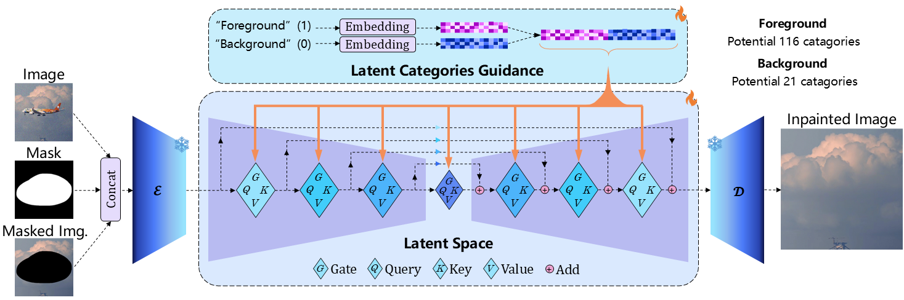
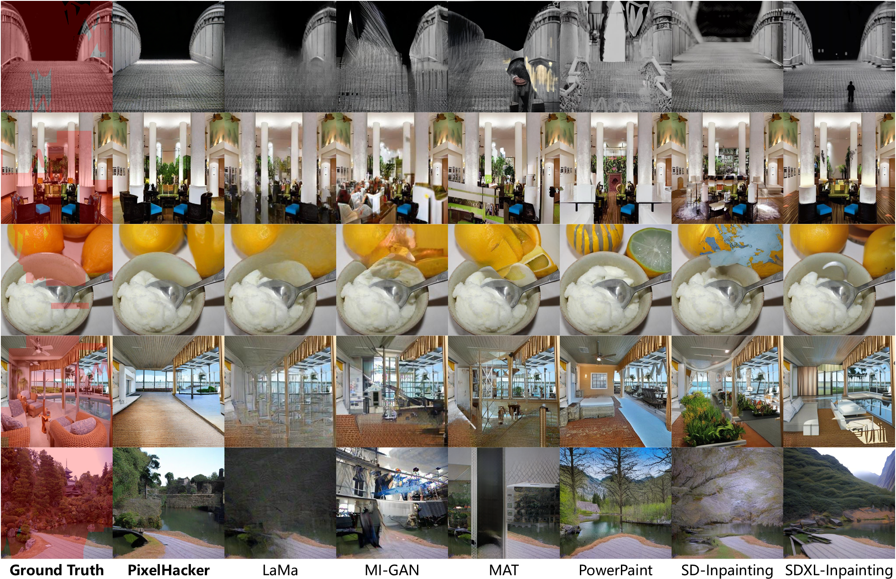
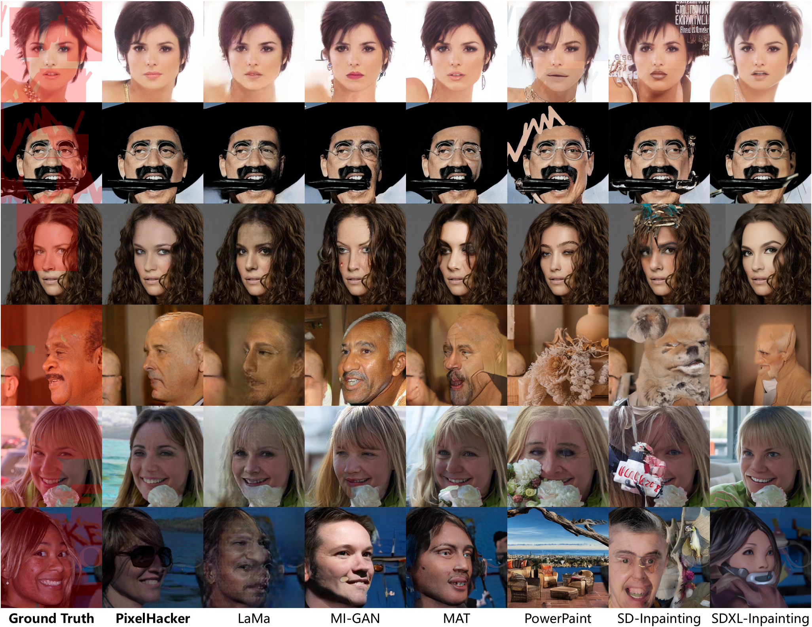

<!--
 * @Author: Xu Ziyang
 * @Date: 2025-04-30 10:28:15
 * @LastEditTime: 2025-05-01 01:10:00
 * @Description: 
-->
<div align="center">
    </img>
</div>
<div align="center">
    </img>
</div>

<div align="center">
<h2>PixelHacker: Image Inpainting with Structural and Semantic Consistency</h2>

**_SOTA performance on Places2, CelebA-HQ, and FFHQ & Superior structural and semantic consistency_**

[Ziyang Xu](https://ziyangxu.top)<sup>1</sup>, [Kangsheng Duan](https://github.com/AnduinD)<sup>1</sup>, Xiaolei Shen<sup>2</sup>, Zhifeng Ding<sup>2</sup>, [Wenyu Liu](http://eic.hust.edu.cn/professor/liuwenyu)<sup>1</sup>, Xiaohu Ruan<sup>2</sup>,  
[Xiaoxin Chen](https://scholar.google.com/citations?hl=zh-CN&user=SI_oBwsAAAAJ)<sup>2</sup>, [Xinggang Wang](https://xwcv.github.io)<sup>1 :email:</sup>

(<sup>:email:</sup>) Corresponding Author.

<sup>1</sup> Huazhong University of Science and Technology. <sup>2</sup> VIVO AI Lab.  

[](https://arxiv.org/abs/2504.20438) [](LICENSE) [](https://hustvl.github.io/PixelHacker) []()
</div>

</img>

## 🌟Highlights
* **Latent Categories Guidance (LCG)**: Simple yet effective inpainting paradigm with superior structural and semantic consistency. Let's advance inpainting research to challenge more complex scenarios!
* **PixelHacker**: Diffusion-based inpainting model trained with LCG, outperforming SOTA performance across multiple natural-scene (Places2) and human-face (CelebA-HQ, and FFHQ) benchmarks!
* **Comprehensive SOTA Performance**：
    * **Places2** (Natural Scene)
        * Evaluated at 512 resolution using 10k test set images with 40-50% masked regions, PixelHacker achieved the best performance with **FID 8.59** and **LPIPS 0.2026**.
        * Evaluated at 512 resolution using 36.5k validation set images with large and small mask settings, PixelHacker achieved the best performance on **FID (large: 2.05, small: 0.82)** and **U-IDS (large:36.07, small:42.21)**, and the second best performance on **LPIPS (large:0.169, small:0.088)**.
        * Evaluated at 256 and 512 resolutions using validation set images with a highly randomised masking strategy, PixelHacker achieved the best performance at 512 resolution with **FID 5.75 and LPIPS 0.305**, and the second best performance at 256 resolution with **FID 9.25 and LPIPS 0.367**.
    * **CelebA-HQ** (Human-Face Scene)
        * Evaluated at 512 resolution, PixelHacker achieved the best performance with **FID 4.75 and LPIPS 0.115**.
    * **FFHQ** (Human-Face Scene)
        * Evaluated at 256 resolution, PixelHacker achieved the best performance with **FID 6.35 and LPIPS 0.229**.

## 🔥Updates

* **`May 1, 2025`**: 🔥 We have released the [project page](https://hustvl.github.io/PixelHacker) with 63+ demos on natural and human-face scenes. Have fun! 🤗
* **`April 30, 2025`:** 🔥 We have released the [arXiv paper](https://arxiv.org/abs/2504.20438) for PixelHacker. The code and project page will be released soon.

## 🏕️Performance on Natural Scene

<div align="center">
</img>
</div>

</img>

</img>

## 🤗Performance on Human-Face Scene
<div align="center">
</img>
</div>

</img>

## 🎓Citation

```shell
@misc{xu2025pixelhacker,
      title={PixelHacker: Image Inpainting with Structural and Semantic Consistency}, 
      author={Ziyang Xu and Kangsheng Duan and Xiaolei Shen and Zhifeng Ding and Wenyu Liu and Xiaohu Ruan and Xiaoxin Chen and Xinggang Wang},
      year={2025},
      eprint={2504.20438},
      archivePrefix={arXiv},
      primaryClass={cs.CV},
      url={https://arxiv.org/abs/2504.20438}, 
}
```
