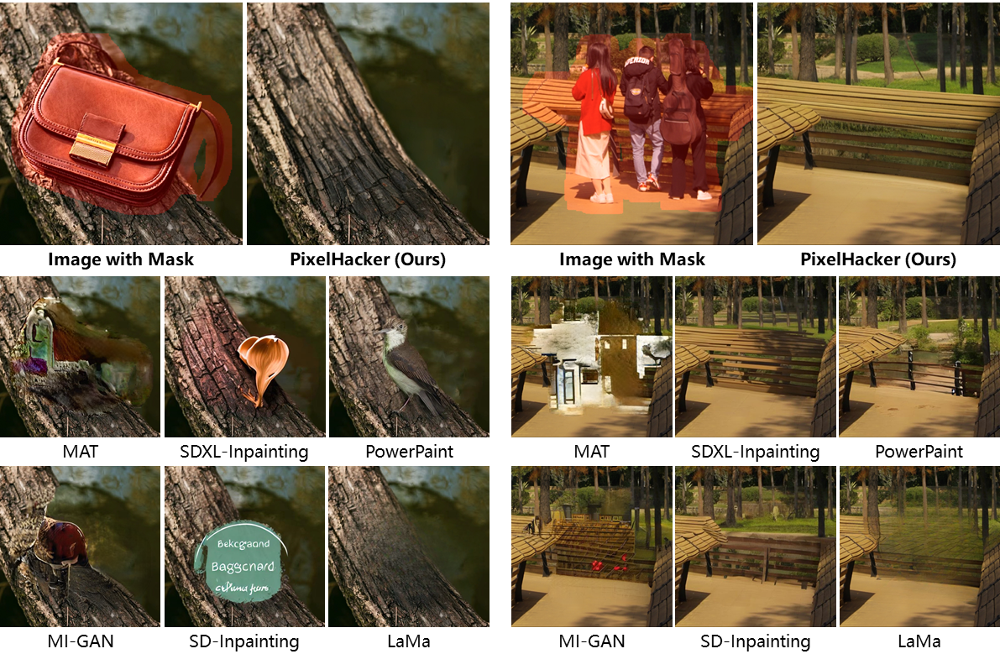

<div align="center">
    </img>
</div>
<div align="center">
    </img>
</div>

<div align="center">
<h2>PixelHacker: Image Inpainting with Structural and Semantic Consistency</h2>

**_SOTA performance on Places2, CelebA-HQ, and FFHQ & Superior structural and semantic consistency_**

[Ziyang Xu](https://ziyangxu.top)<sup>1</sup>, [Kangsheng Duan](https://github.com/AnduinD)<sup>1</sup>, Xiaolei Shen<sup>2</sup>, Zhifeng Ding<sup>2</sup>, [Wenyu Liu](http://eic.hust.edu.cn/professor/liuwenyu)<sup>1</sup>, Xiaohu Ruan<sup>2</sup>,  
[Xiaoxin Chen](https://scholar.google.com/citations?hl=zh-CN&user=SI_oBwsAAAAJ)<sup>2</sup>, [Xinggang Wang](https://xwcv.github.io)<sup>1 :email:</sup>

(<sup>:email:</sup>) Corresponding Author.

<sup>1</sup> Huazhong University of Science and Technology. <sup>2</sup> VIVO AI Lab.  

[](https://arxiv.org/abs/2504.20438) [](LICENSE) [](https://hustvl.github.io/projects/PixelHacker) []()
</div>

</img>

## 🌟Highlights
* **Latent Categories Guidance (LCG)**: Simple yet effective inpainting paradigm with superior structural and semantic consistency. Let's advance inpainting research to challenge more complex scenarios!
* **PixelHacker**: Diffusion-based inpainting model trained with LCG, outperforming SOTA performance across multiple natural-scene (Places2) and human-face (CelebA-HQ, and FFHQ) benchmarks!

## 🔥Updates

* **`April 30, 2025`:** We have released the [arXiv paper](https://arxiv.org/abs/2504.20438) for PixelHacker. The code and project page will be released soon.

## 🏕️Performance on Natural Scene

<div align="center">
</img>
</div>

</img>

</img>

## 🤗Performance on Human-Face Scene
<div align="center">
</img>
</div>

</img>

## 🎓Citation

```shell
@misc{xu2025pixelhacker,
      title={PixelHacker: Image Inpainting with Structural and Semantic Consistency}, 
      author={Ziyang Xu and Kangsheng Duan and Xiaolei Shen and Zhifeng Ding and Wenyu Liu and Xiaohu Ruan and Xiaoxin Chen and Xinggang Wang},
      year={2025},
      eprint={2504.20438},
      archivePrefix={arXiv},
      primaryClass={cs.CV},
      url={https://arxiv.org/abs/2504.20438}, 
}
```
